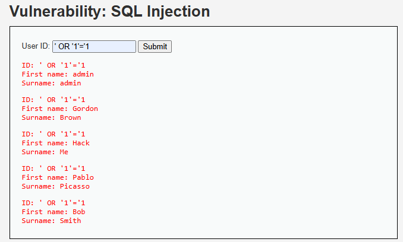

# Inyección SQL

## ¿Qué es una inyección SQL?

Formalmente, una inyección SQL consiste en la inserción de código SQL malicioso a través de los datos de entrada del cliente hacia la aplicación, lo que permite a un atacante leer, modificar o eliminar información de la base de datos sin autorización (OWASP Foundation, s. f.).

## Imagen Referencial del Caso

## Referencias Bibliográficas

- SQL Injection. (s/f). Owasp.org. Recuperado el 21 de junio de 2026, de https://owasp.org/www-community/attacks/SQL_Injection
