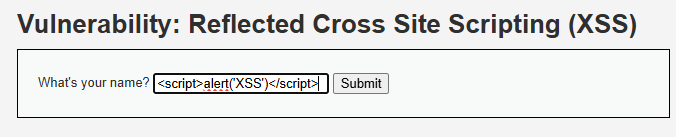
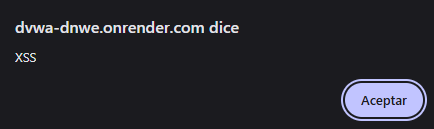

# Cross-Site Scripting (XSS)

## ¿Qué es un ataque XSS?

Como tal, son un tipo de inyección en la que scripts maliciosos se introducen en sitios web que, de otro modo, son legítimos y de confianza, ocurriendo cuando un atacante utiliza una aplicación web para enviar código malicioso, generalmente en forma de un script del lado del navegador, hacia otro usuario. Las fallas que permiten que estos ataques tengan éxito son bastante comunes y ocurren en cualquier lugar donde una aplicación web utilice datos de entrada de un usuario dentro del contenido que genera, sin validarlos ni codificarlos adecuadamente (OWASP Foundation, s. f.).

En sí, para este caso, se utilizará un ataque de XSS reflejado, el cual ocurre cuando un usuario es engañado para enviar un formulario manipulado, momento en el cual el código inyectado viaja hasta el sitio vulnerable, que refleja el ataque de vuelta hacia el navegador de la víctima, por lo que el navegador entonces ejecuta el código porque proviene de un servidor "confiable" (OWASP Foundation, s. f.).

## Imagen Referencial del Caso

- Ingreso del script

- Resultado

## Referencias Bibliográficas

- OWASP Foundation. (s. f.). Cross Site Scripting (XSS). OWASP Foundation. https://owasp.org/www-community/attacks/xss/